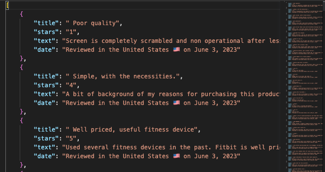

# Amazon Wearable Tech Reviews Scraper

This project harnesses the power of Node.js, Puppeteer, and the Bright Data Proxy Browser to scrape thousands of product reviews of different wearable technologies from Amazon. The inspiration and initial code template for this project was sourced from https://www.youtube.com/watch?v=qo_fUjb02ns

The scraper will start scraping Amazon for reviews of wearable technology products, and the scraped data will be saved in a JSON file in the project directory. The outputs of this web scraper essentially create a custom API for Amazon reviews.

The subsequent data is stored in a postgres instance using the special JSONB object type and will be used to perform a detailed sentiment analysis on various wearable technology products for market research, revealing which features are most frequently praised and which ones could use some improvement. More use cases for the data including a type of vector database are being workshopped. 

## Issues
- As is nature of webscraping the program is prone to break which requires manual restarting and updating of page number. Looking to automate this process
- Create a user interface that will allow user to search the product they want to scrape and then proceed with script (front end of 'search_function.')
- When search_function.js and index.js are combined it makes it harder to restart the program once it breaks since multiple products are being scraped and starting it over will start from product 1, hence the url_tracking in teh txt document to allow for manual restarting.

## Features

- Efficiently scrapes thousands of reviews with the use of Bright Data Proxy Browser.
- Uses Puppeteer, a powerful browser automation tool, to interact with the Amazon website just like a human user would.

## Coming Soon
- Performs sentiment analysis on the collected reviews to identify commonly praised and criticized product features.
- Streamlined process that allows users to select their product of interest and allow the script to run in the background without user interaction.

------
